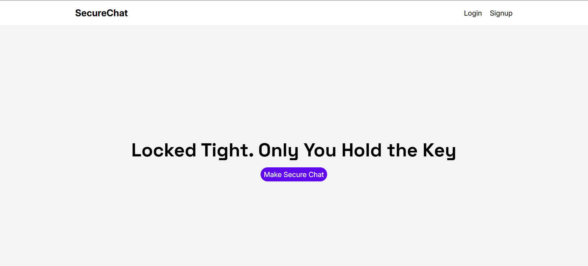

# SecureChat

SecureChat is an end-to-end encrypted (E2EE) real-time chat application built with React for the frontend, Socket.io for real-time messaging, and MongoDB with Express.js for the backend. It uses RSA encryption to generate private and public keys on the client side, ensuring secure communication.

## Features

- **End-to-End Encryption (E2EE)**: Messages are encrypted using RSA before being sent.
- **Real-Time Messaging**: Uses Socket.io for instant chat functionality.
- **Secure Key Generation**: RSA keys are generated client-side for privacy.
- **User Authentication**: Secure login and registration.
- **MongoDB Database**: Stores user data and chat history securely.
- **Responsive UI**: Built with React for a seamless user experience.

## Screenshots




## Installation

### Client Setup

```sh
cd client
npm install
npm start
```

### Server Setup

```sh
cd server
npm install
npm start
```

## Repository

[Secu](https://github.com/AravindhPrabu2005/secure-chat)[reChat GitHub Repository](https://github.com/AravindhPrabu2005/secure-chat)

##
